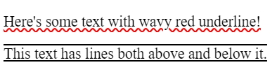

# text-decoration

Short hand of
Formal syntax `<'text-decoration-line'> || <'text-decoration-style'> || <'text-decoration-color'> || <'text-decoration-thickness'>`

here `text-decoration-color` is same as color, and `text-decoration-thickness` is same as size

## text-decoration-line

Formal syntax `none | [ underline || overline || line-through || blink ]`, none or underline or underline overline.**`blink`** is deprecated in favour of animation.

```html
<p class="wavy">Here's some text with wavy red underline!</p>
<p class="both">This text has lines both above and below it.</p>
```

```css
.wavy {
  text-decoration-line: underline;
  text-decoration-style: wavy;
  text-decoration-color: red;
}

.both {
  text-decoration-line: underline overline;
}
```



## text-decoration-style

Formal syntax `solid | double | dotted | dashed | wavy`

# inherit-initial-unset-revert

All these values can be set on every css property

- `inherit`: inherit value from its parent
- `initial`:initial value is the default value defined in css specification
- `unset`: unset apply inherit if initial inherit is on.
- `revert`: revert the value to browser style sheet.
